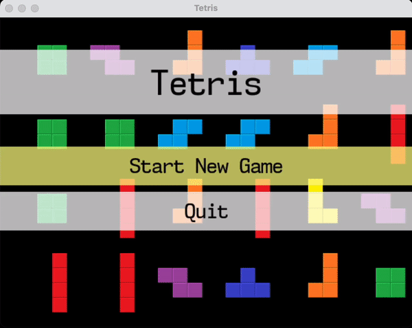

# tetris

### Dependencies

- cmake
- SDL2
- SDL2_ttf

### Building

```sh
$ cmake .
$ make
```

You will probably need to hack CMakeLists.txt to point it to the right location of the SDL includes.

### Self-playing mode



Leave the main menu still for few seconds to run self-play mode.
